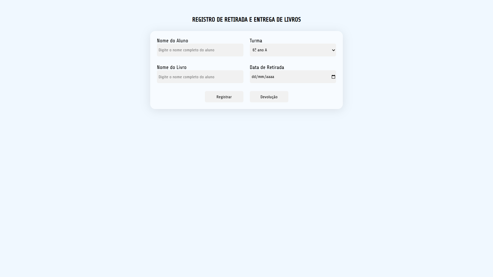
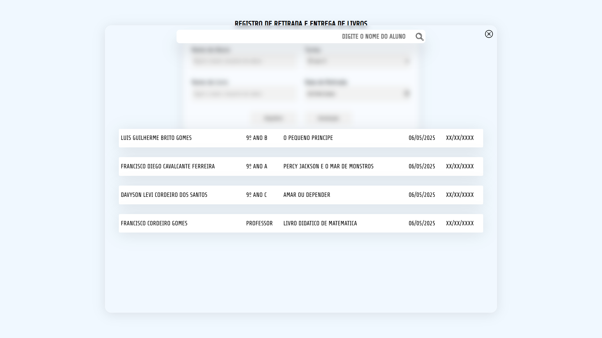
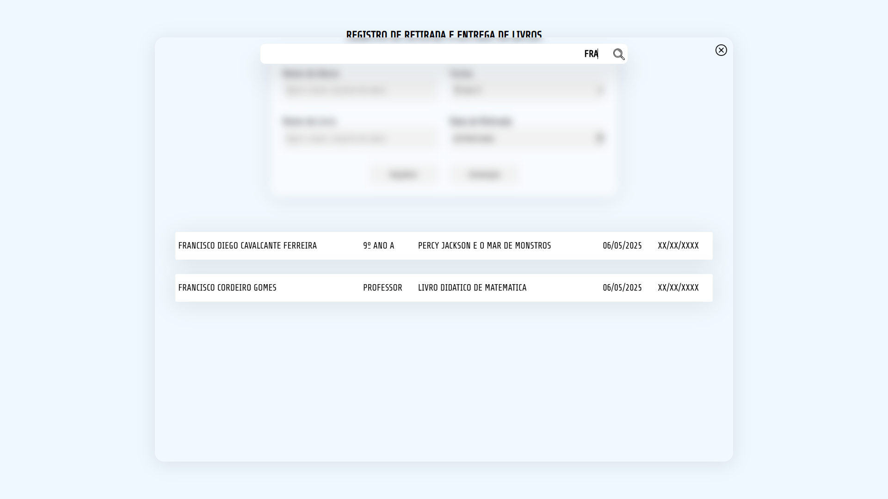
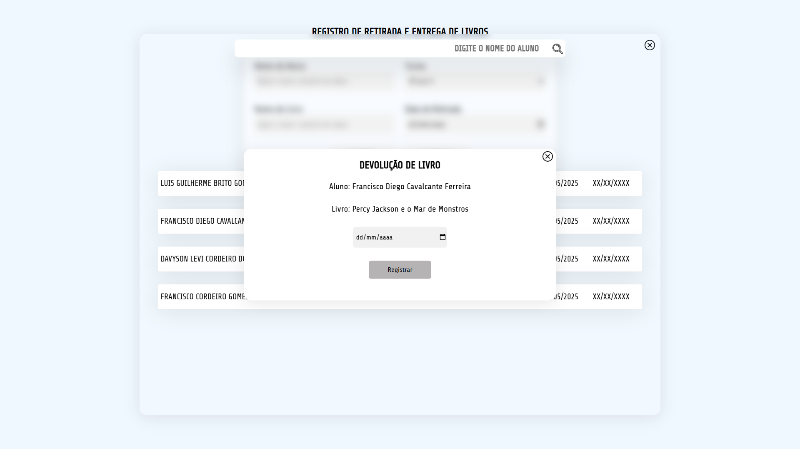

## Registro de Retirada e Devolução de Livros 📖

Projeto criado com o intuito de registrar os livros retirados e devolvidos na escola que eu trabalho. 
layout simples feito somente para substituir o caderno que eram anotados os registros, onde constava somente o nome do aluno a turma e data de retirada e entrega dos livros.

## Funcionalidades 👨‍💻

<ul> 
 <li> Registrar o aluno, o livro, a turma e a data de retirada e entrega do(s) livro(s).</li> 
 <li>Exibir todos os registros feitos com o nome do aluno, nome do livro, turma, data de retirada e entrega de livros.</li> 
 <li>Buscar pelo nome do aluno um registro de retirada ja efetuado.</li> 
</ul>

## Layout 🎨  

   

    

>*Tem muitas melhorias a serem feitas no layout mas ele é funcional e responsivo e ja consegue substituir o antigo caderno que era ultilizado.*
    
## Tecnologias Usadas 💻  

 

#### Observações e futuras alterações: 
  - Ja existem elementos na area de devolução pois estão inseridos no html.
  - Ainda há alterações para ser realizadas tais como:
      - Botão para tirar a data de devolução caso o usuário erre.
      - Botão para ver todos os livro devolvidos e outro para os não devolvidos.
      - Criar uma ficha para cada aluno que tenha as informações do aluno e os livros que ele já pegou e devolveu.
      - Deixar mais intuitivo na lista de devolução dos livros.
